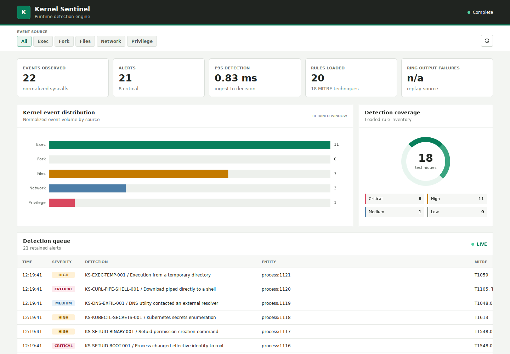
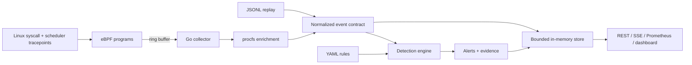

# Kernel Sentinel

**An auditable Linux runtime detection engine built with eBPF and Go.**

Kernel Sentinel is a compact, inspectable runtime-security prototype. Its Linux
probe observes selected syscall outcomes, its Go pipeline enriches and
normalizes events, and its deterministic engine evaluates single-event rules,
temporal sequences, and a decaying behavioral score. The same normalized event
contract drives live collection and a privilege-free replay harness.

This repository is deliberately evidence-led: every benchmarked detection has
a named scenario, an expected rule, a MITRE ATT&CK mapping, and benign
counterexamples. It is a research and portfolio system—not a production EDR,
not an antivirus, and not a syscall enforcement mechanism.

## Dashboard Preview

Built Go application in replay mode with `lab/events/attack-suite.jsonl`. This preview shows replayed events; live eBPF collection requires a suitable Linux host and privileges.

## Evidence snapshot

| Measurement | Reference result | Scope |
|---|---:|---|
| Scenario recall | **20/20 (100%)** | Curated synthetic attack corpus |
| Benign alerts | **0/12** | Curated benign corpus; not a production false-positive estimate |
| Matching latency p50 | **52 ns** | Previous replay session, in-process matching only |
| Matching latency p95 | **62 ns** | Previous replay session, in-process matching only |
| Detection rules | **20** | 18 single-event rules and 2 temporal sequences |

The latency figures exclude syscall execution, eBPF collection, ring-buffer
transport, scheduling, JSON parsing, enrichment, API delivery, and network
rendering. Hardware and runtime metadata were not retained for that session, so
the values are a historical reference—not a portable performance claim. See
[the methodology](docs/METHODOLOGY.md) and the
[versioned reference matrix](benchmarks/reference/MATRIX.md).

## What is implemented

- Nine eBPF tracepoint programs: execve, openat, connect, and setuid
  entry/exit pairs plus sched_process_fork, including the first six bounded
  exec arguments.
- A per-CPU scratch map, bounded LRU map for in-flight syscalls, and 16 MiB BPF
  ring buffer.
- Per-CPU probe health counters for successful submissions, ring-buffer output
  failures, pending-map failures, and user-space decode/reader failures.
- Go normalization with syscall outcome, process identity, file/network data,
  monotonic-to-wall-clock conversion, and raw syscall duration.
- Best-effort enrichment from procfs for post-exec name/command line, parent
  process, cgroup-derived container identity, and runtime.
- Strict YAML rule loading, reusable match operators, ordered temporal
  sequences, MITRE metadata, stable alert IDs, and evidence retention.
- Optional risk accumulation per process or container with decay and cooldown.
- Replay, functional benchmarking, JSONL alerts, REST endpoints, server-sent
  alerts, Prometheus text metrics, and an embedded dashboard.
- A distroless runtime image, a constrained live Docker deployment, a
  Kubernetes DaemonSet, tests, race checks, linting, and CI.

## Data flow

Live and replay sources converge only after normalization. Benchmarks therefore
exercise the rule engine deterministically, but they do **not** validate kernel
capture fidelity or end-to-end live latency.

## Telemetry coverage

| Normalized event | Kernel source | Captured directly | Important boundary |
|---|---|---|---|
| process.exec | execve | requested image path, first 6 arguments, post-success comm, identity, outcome | No execveat; each argument is bounded to 127 useful bytes |
| process.fork | sched_process_fork | parent/child PID and kernel command names | No clone flags or namespace transition metadata |
| file.open | openat | submitted path, flags, directory FD, return code | Relative paths are not resolved; no open/openat2 |
| network.connect | connect | FD, IPv4/IPv6 address and port, return code | Other address families retain only their numeric family |
| privilege.setuid | setuid | target UID and return code | Other credential-changing syscalls are not covered |

The kernel-side command name is limited to 16 bytes, paths to 256 bytes, and
each of the first six exec arguments to 128 bytes including its terminator.
Additional arguments and truncated suffixes are discarded without an explicit
truncation flag. Container context is inferred in user space from
64-character cgroup IDs. These constraints are part of the detection model,
not implementation footnotes.

## Detection catalog

The current rules cover:

- reverse-shell-like shell-to-network sequences;
- execution from tmpfs or temporary directories;
- successful access to /etc/shadow and likely SSH private keys;
- authorized_keys, cron, and systemd persistence;
- shells spawned by common web workers;
- container miner markers, namespace tools, Docker socket access, Kubernetes
  token access, and a controlled escape marker;
- log deletion commands and setuid privilege patterns;
- Kubernetes secret enumeration, an external DNS utility pattern, direct
  downloader-to-shell commands, and transfer-then-execute sequences.

Several detections are intentionally high-signal lab patterns. They are not a
claim of complete behavioral coverage for the corresponding ATT&CK technique.
The full rule definitions live in [rules/runtime.yaml](rules/runtime.yaml) and
[rules/sequences.yaml](rules/sequences.yaml).

## Quick start: deterministic replay

Requirements: Go 1.25, clang, LLVM, and make. Replay itself needs no elevated
kernel privileges.

    make build
    ./bin/kernel-sentinel \
      -source replay \
      -replay lab/events/attack-suite.jsonl \
      -rules rules \
      -listen 127.0.0.1:8081 \
      -alerts alerts.jsonl

Open http://127.0.0.1:8081. After the replay reaches EOF, the API remains
available until interrupted. For a batch-only run:

    ./bin/kernel-sentinel \
      -source replay \
      -replay lab/events/attack-suite.jsonl \
      -rules rules \
      -listen '' \
      -alerts alerts.jsonl \
      -behavioral=false \
      -exit-on-eof

Replay input must be time ordered. Set a positive speed multiplier to preserve
relative event delays; zero processes the corpus without intentional delay.

## Reproduce the functional benchmark

    make benchmark

The benchmark loads both corpora into fresh rule engines, disables behavioral
scoring, writes JSON/CSV/Markdown reports under reports/, and fails unless
scenario recall is 100% and benign alerts remain zero. Generated reports are
ignored by Git; the reviewed reference snapshot is under
[benchmarks/reference](benchmarks/reference/README.md).

Expected functional result for the committed fixtures:

| Corpus | Records | Evaluation |
|---|---:|---|
| Attack | 22 events / 20 scenarios | 20 expected detections |
| Benign | 12 events | 0 alerts |

Exact nanosecond timings should change between runs. The functional gates are
the reproducible claim.

## Run in Docker

Replay mode:

    docker compose up --build

Live mode on an authorized Linux host:

    docker compose -f docker-compose.live.yml up --build

Live collection needs kernel support for the selected BPF features and access
to syscall tracepoints. The compose file requests only BPF, PERFMON, and
SYS_RESOURCE capabilities, mounts host procfs/BTF read-only, uses a read-only
root filesystem, and drops all other capabilities. It also uses host PID and
network namespaces and listens on all host interfaces; treat it as a local
demonstrator, not a shared-host deployment. Kernel lockdown, container runtime
policy, or older kernels can still prevent loading.

The isolated 20-scenario demonstration uses a private Docker network, fixed
markers, synthetic files, and a networkless report container:

    make live-lab

It writes alerts and JSON/CSV/Markdown output to the live-results volume and
prints the Markdown matrix. Live kernel events normally have no scenario_id, so
the report labels those matches **rule-ID presence only**; it does not claim
that a specific lab action caused an alert. Expected-rule coverage is an
explicit gate by default (`LIVE_LAB_MIN_COVERAGE=1`). To collect a diagnostic
report on an incompatible kernel without enforcing that gate:

    LIVE_LAB_MIN_COVERAGE=0 make live-lab

The [lab directory](lab/) does not mount the host Docker socket, target a real
cluster, mine cryptocurrency, or run a real container escape. Its collector
still uses host PID visibility and BPF privileges, so review it and run only on
a disposable, authorized Linux system.

## Kubernetes

The DaemonSet uses host PID visibility without host networking, read-only
procfs/tracefs/BTF mounts, and the same narrow capability set:

    kubectl apply -k deploy/kubernetes

Its API is a ClusterIP protected by a default-deny policy: same-namespace
clients must opt in with the kernel-sentinel.io/api-client=true pod label.
This is network isolation, not application authentication or TLS, and it
depends on a NetworkPolicy-capable CNI.

The Kubernetes lab overlay requires an explicit disposable-node label:

    kubectl label node NODE kernel-sentinel.io/lab=true
    kubectl apply -k deploy/kubernetes/lab

Before either deployment, publish images you control and update the image
overrides in the corresponding kustomization files. The lab overlay adds an
ephemeral safe-action Job, internal sink, and restrictive network policies.
Platform-specific BPF permissions and durable alert export remain operator
responsibilities.

## API and operations

The binary defaults to loopback. The top-level Compose examples publish or bind
the API beyond loopback and need host-level access control. The live lab does
not publish its API; Kubernetes uses ClusterIP plus NetworkPolicy.

| Endpoint | Purpose |
|---|---|
| GET /healthz | Process and source status |
| GET /api/v1/stats | Event/alert/probe counters and rolling p95 decision latency |
| GET /api/v1/events?limit=N | Newest normalized events, maximum 500 |
| GET /api/v1/alerts?limit=N | Newest alerts and evidence, maximum 500 |
| GET /api/v1/rules | Loaded rule metadata and predicates |
| GET /api/v1/stream | Server-sent alert stream, maximum 32 concurrent streams |
| GET /metrics | Prometheus text exposition |

The API has security headers and bounded result sizes, but no authentication,
authorization, or TLS. Events and alert evidence can expose paths, arguments,
addresses, and identifiers. Keep the listener on loopback or place it behind a
trusted authenticated proxy.

## Rule model

Rule documents are decoded with unknown-field rejection. A rule must define
exactly one match block or an ordered sequence, a score from 1 to 100, a known
severity, and at least one MITRE identifier. Supported operators are equality,
inequality, contains, prefix, suffix, regular expression, membership, numeric
comparisons, and existence.

    rules:
      - id: KS-EXAMPLE-001
        title: Example temporary execution
        description: Demonstrates the single-event rule contract.
        severity: high
        score: 75
        mitre: [T1059]
        match:
          all:
            - {field: kind, op: eq, value: process.exec}
            - {field: process.executable, op: prefix, value: /tmp/}

Sequence state is in memory and grouped by a selected event field. It is not
durable across restarts.

## Development

    make lint
    make test
    make race
    make benchmark
    make build

CI repeats formatting, vetting, race-enabled tests, coverage generation,
command builds, and a container build. New detections should include a stable
rule ID, positive ground truth, negative fixtures, and documented telemetry
dependencies; see [CONTRIBUTING.md](CONTRIBUTING.md).

## Security and engineering limits

- Observation and alerting only: no syscall blocking or automated response.
- Four syscall families plus one scheduler event, bounded exec arguments,
  unsupported non-IP address families, and best-effort procfs enrichment
  leave explicit evasion paths.
- Ring-buffer output and pending-map failures are exported through the stats
  API, Prometheus endpoint, and dashboard. They have not yet been characterized
  under controlled overload, and their sum is not a unique lost-event count.
- Sequence and behavioral state are process/container keyed, memory resident,
  and not designed for hostile-cardinality workloads.
- The in-memory API store retains at most 5,000 events and 2,000 alerts; there
  is no durable event backend.
- The 12-event benign fixture is a regression corpus, not evidence of a
  production false-positive rate.
- Dashboard HTML, CSS, JavaScript, and icons are embedded in the binary; its
  content security policy permits only same-origin scripts and styles.

Read [ARCHITECTURE.md](docs/ARCHITECTURE.md) for system mechanics,
[THREAT_MODEL.md](docs/THREAT_MODEL.md) for trust assumptions and abuse cases,
and [METHODOLOGY.md](docs/METHODOLOGY.md) for the experimental protocol and
validity limits.

## Author and license

Designed and implemented by **Vincent Plessy**. Released under the
[MIT License](LICENSE).
