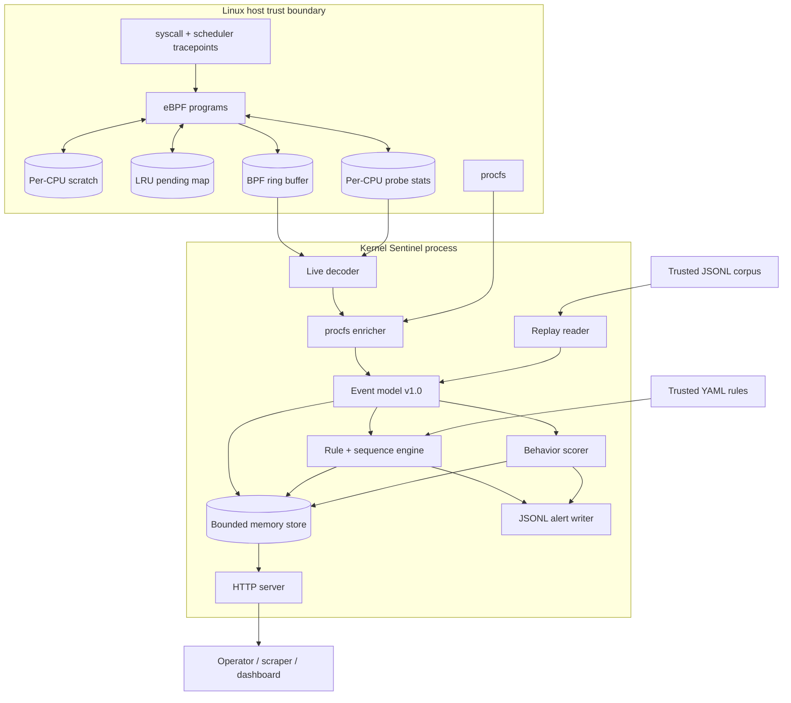

# Architecture

## Purpose and scope

Kernel Sentinel is an observe-and-alert runtime-security prototype for Linux.
It has two interchangeable event sources:

1. a live eBPF collector for selected syscall tracepoints; and
2. a JSONL replay reader for deterministic development and evaluation.

Both sources emit the same versioned event model before rules are evaluated.
This boundary makes detection logic testable without kernel privileges, while
keeping live-collection assumptions visible.

The implementation optimizes for auditability and bounded kernel state. It does
not attempt full syscall coverage, prevention, durable telemetry storage, or
multi-node correlation.

## System context

## Component map

| Component | Location | Responsibility |
|---|---|---|
| Kernel probe | bpf/sentinel.bpf.c | Capture syscall/scheduler context, outcomes, and probe health counters |
| Generated bindings | internal/probe/bpf_* | Embed BPF objects for little- and big-endian targets |
| Live collector | internal/probe/probe_linux.go | Attach programs, decode ring records, normalize time and fields |
| Enricher | internal/enrich/proc.go | Add executable, arguments, parent, host, and container context |
| Replay source | internal/source/replay.go | Validate and emit ordered JSONL events |
| Event contract | internal/model/event.go | Versioned normalized schema and rule-addressable fields |
| Detection | internal/detection | Load/validate rules, match predicates, correlate sequences, score behavior |
| Pipeline | internal/pipeline/pipeline.go | Own source lifecycle and fan events/alerts into outputs |
| Store | internal/store/store.go | Retain bounded recent state, probe counters, latency samples, SSE subscribers |
| API/UI | internal/api | Expose health, state, rules, stream, metrics, and embedded assets |
| Benchmark | internal/benchmark | Evaluate ground truth and benign fixtures and emit reports |

## Live event lifecycle

### 1. Kernel event entry

Nine tracepoint programs cover enter/exit pairs for execve, openat, connect,
and setuid plus sched_process_fork. On syscall entry, the probe records:

- monotonic timestamp from bpf_ktime_get_ns;
- cgroup ID;
- PID, TID, PPID when available, UID, and GID;
- the current 16-byte kernel command name;
- syscall-specific path, flags, FD, address, port, or target UID;
- for execve, at most six arguments of 128 bytes each including terminators.

The C event record is 1,152 bytes, larger than the 512-byte eBPF stack limit.
Assembly therefore uses a one-entry-per-CPU scratch array. The partial event is
then copied into a BPF LRU hash keyed by TID. The pending map is bounded at
16,384 entries. TID correlation is valid for an enter/exit pair because a
thread cannot execute a second userspace syscall while the first is active.

The scheduler fork program records the parent and child PID/comm values and
submits that event directly; it does not use the pending syscall map.

### 2. Syscall exit

The exit program retrieves the pending record, adds the return value and
kernel-observed syscall duration, refreshes comm after a successful execve,
outputs one fixed-size ring-buffer record, and deletes the pending entry. The
ring buffer is bounded at 16 MiB.

If the pending record is absent, has the wrong event type, or ring output fails,
no event is emitted. A per-CPU array records successful ring submissions,
ring-output failures, pending-map update/lookup/type/delete failures, and the Go
collector records decode, normalization, reader, and counter-read failures.
These cumulative values are aggregated when `/api/v1/stats` or `/metrics` is
read.

A ring-output failure is a definite failed submission. A pending lookup miss
can result from an earlier update failure, LRU eviction, collection beginning
mid-syscall, or another correlation gap. Failure counters can therefore overlap
and must not be summed as a unique event-loss estimate. Successful submission
also does not prove that user space normalized and stored the record; the
separate user-space counters make those later failures visible.

### 3. User-space normalization

The Go collector reads records using native byte order and maps the five kernel
event types to:

- process.exec;
- process.fork;
- file.open;
- network.connect;
- privilege.setuid.

It reconstructs a wall timestamp from a wall-clock/monotonic reference pair,
sets observed_at when the record is decoded, and preserves cgroup_id and
duration_ns under the raw field. A non-negative syscall return value is treated
as success; connect returning EINPROGRESS is also successful because a
non-blocking connection has started asynchronously.

IPv4 and IPv6 endpoints are decoded. Other address families retain their
numeric family but no address. Submitted openat paths are preserved as supplied
by the calling process; relative paths are not resolved against the directory
FD.

### 4. Best-effort procfs enrichment

For a live event, the enricher reads the process directory under /proc, or the
root selected by SENTINEL_PROC_ROOT. It may refine or add:

- the executable target for non-exec events, while preserving the path requested
  by execve;
- post-exec name from comm, with the requested executable basename as fallback;
- null-delimited command-line arguments, falling back to bounded eBPF arguments
  when procfs is unavailable;
- PPID and the parent's comm value;
- a 64-hex-character cgroup container ID;
- a runtime hint for Docker, containerd, or CRI-O.

Every lookup is best effort. Short-lived processes, PID reuse, permissions,
namespace differences, or concurrent exec/exit can make fields absent or refer
to a later process state. The probe refreshes process.name at successful exec
exit, and enrichment can refresh it again; if procfs has disappeared, the
requested executable basename is the fallback. The requested executable path
and bounded eBPF arguments remain available when the process exits before
procfs enrichment. Arguments beyond six and suffixes beyond 127 useful bytes
are dropped without a truncation indicator.

## Normalized event contract

All events use schema_version 1.0. The core clocks have distinct semantics:

| Field | Meaning |
|---|---|
| timestamp | When the source says the event occurred |
| observed_at | When user space accepted or refreshed the event |
| raw.duration_ns | Live-only syscall entry-to-exit duration |

Replay preserves timestamp but sets a missing observed_at to ingestion time.
The benchmark intentionally replaces observed_at immediately before rule
evaluation.

An absent event ID is derived from timestamp, TID, and kind. That value is
useful for local correlation but is not a cryptographic global identifier.
Alert IDs are the first 96 bits of SHA-256 over the rule ID and ordered evidence
event IDs.

The rule engine can address scalar fields exposed by Event.Field, including
derived booleans for file write/create/truncate and whether a parsed network
address is external.

## Detection engine

### Rule validation

YAML decoding rejects unknown fields. Enabled rules must have:

- an ID matching the KS uppercase identifier convention;
- non-empty title and description;
- severity low, medium, high, or critical;
- score from 1 through 100;
- at least one MITRE identifier;
- exactly one single-event match block or a sequence of at least two steps.

Regexes are compiled during validation and cached by pattern for event matching.
Duplicate IDs across files are rejected. Files are loaded in lexical path order.

### Predicate semantics

A match block evaluates all conditions in all. If any is present, at least one
of those conditions must also match. Equality, contains, prefix, suffix, and
membership comparisons are case-insensitive; regex case behavior is explicit
in the pattern. Numeric comparisons coerce supported integer, float, and
numeric-string values.

### Temporal sequences

Each sequence keeps overlapping partial states per rule and grouping entity.
On each event:

1. expired states are discarded using source timestamps;
2. matching states advance by one ordered step;
3. completed states emit an alert containing all evidence;
4. a matching first step starts another state.

The two repository sequences group by process.pid or container.id and enforce
10-second or 2-minute windows. State is process-local and non-durable. Expired
states are removed when their entity is evaluated, plus a global time-based
sweep every 1,024 processed events. There is no hard cardinality bound, and PID
reuse is not yet mitigated.

Replay rejects decreasing timestamps. Live mode relies on source ordering and
does not independently reorder events.

### Behavioral scoring

When enabled, a profile is keyed by container ID when present, otherwise PID.
Suspicious features add fixed weights; the score decays with a two-minute
half-life, is capped at 100, alerts at 60, and has a 30-second cooldown.
Profiles idle for more than ten half-lives are removed during the engine's
1,024-event maintenance sweep.

The alert emitted at threshold crossing contains the current event as evidence.
It does not retain the complete historical feature chain. The benchmark
disables this scorer so regression results describe only the 20 deterministic
YAML rules.

## Pipeline and concurrency

The pipeline starts one source goroutine and consumes a buffered channel of
1,024 normalized events in a single goroutine. For each event it performs
enrichment, storage, detection, alert storage, and optional JSON encoding in
order.

Consequences:

- matching and sequence transitions are serialized and race-free;
- a slow alert writer or detector applies backpressure to collection;
- kernel ring-buffer pressure can then cause unreported reservation failures;
- a JSONL write failure terminates the pipeline and marks the source as error.

Cancellation closes the ring reader and all attached links. Replay closes its
file after the pipeline completes.

## Retention and delivery

The default process store uses fixed-capacity circular buffers and retains:

- the newest 5,000 events;
- the newest 2,000 alerts;
- the newest 2,048 alert latency samples.

Lifetime counters are independent of retained buffers. REST results are returned
newest first and capped at 500 items. At most 32 SSE streams are accepted, and
each subscriber receives a channel buffer of 32; delivery to a slow subscriber
is dropped rather than blocking the pipeline. The store is not a durable audit
log.

The HTTP server has read/write/idle timeouts, common browser security headers,
and a self-contained embedded dashboard with a same-origin content security
policy. It has no built-in authentication, authorization, or transport
encryption. The default listener is 127.0.0.1:8081; any non-loopback deployment
requires an external access-control layer.

## Latency definitions

DetectionLatency is computed when an alert is built:

    detection time - latest observed_at among evidence events

Negative values are clamped to zero. This is decision latency after user-space
observation, not event-to-alert latency.

For replay benchmarks, observed_at is assigned just before Engine.Process.
Therefore the historical 52 ns p50 and 62 ns p95 measure only the in-process
path to the matching alert. They exclude event loading and every live-collection
stage. The dashboard's rolling p95 uses the same alert field over up to 2,048
recent alerts.

## Deployment profiles

| Profile | Source | Privilege | Intended use |
|---|---|---|---|
| Local replay | JSONL | None beyond normal process access | Rule development and demos |
| Default container | JSONL | Non-root, all capabilities dropped | Portable UI/replay |
| Live compose | eBPF | Root plus BPF/PERFMON/SYS_RESOURCE | Authorized disposable Linux host |
| Kubernetes DaemonSet | eBPF | Host PID/network and selected capabilities | Cluster demonstrator |

The runtime image is distroless and non-root by default. Live profiles override
the user because BPF loading and host procfs inspection need additional access.
Actual permission requirements depend on kernel version, lockdown state,
container runtime, and platform policy.

## Design invariants

- Kernel maps and copied strings are bounded.
- The probe reports syscall outcome, not just intent.
- Replay is the default source.
- Rules are configuration, but are trusted code-like input and validated
  strictly before collection starts.
- Alerts preserve the normalized evidence used for the decision.
- The agent never blocks, rewrites, or injects a syscall.
- Functional benchmark claims remain separate from live-system claims.

Residual risks and security assumptions are developed in
[THREAT_MODEL.md](THREAT_MODEL.md). Measurement design and limitations are in
[METHODOLOGY.md](METHODOLOGY.md).
