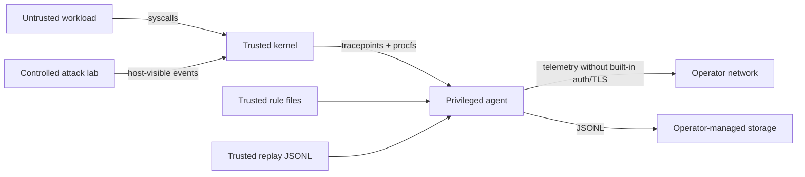

# Threat model

## Model status

This document models Kernel Sentinel 0.1.0 as implemented in this repository.
It covers the live agent, replay path, rule configuration, HTTP surface, and
controlled lab. It does not treat the project as a production control or claim
resistance to a fully privileged host attacker.

The central security property is modest:

> Given a supported event that reaches the normalized pipeline intact, evaluate
> trusted rules predictably and preserve the evidence behind each alert.

Kernel Sentinel is a detective control. It is not an isolation boundary.

## Assets

| Asset | Security need | Why it matters |
|---|---|---|
| Rule set and configuration | Integrity, provenance | Modified rules can silence or manufacture detections |
| Normalized events | Integrity, ordering, bounded availability | Rules depend on exact field values and sequence order |
| Alert evidence | Integrity, confidentiality | Evidence supports triage but can expose host context |
| Agent process and BPF links | Availability, integrity | Disabling either creates a telemetry blind spot |
| Host kernel and procfs | Integrity | They are the source of live truth |
| API and metrics | Confidentiality, availability | They expose operational telemetry |
| Synthetic benchmark corpus | Integrity, traceability | It is the basis for published functional claims |
| Lab host | Safety | The collector is privileged enough to observe host activity |

## Data sensitivity

The probe does not read file contents or network payloads. It can still collect
sensitive metadata:

- executable paths and submitted file paths;
- command-line arguments, which sometimes contain tokens or passwords;
- user and process identifiers;
- IP addresses, ports, image names, container IDs, and pod names;
- complete normalized events embedded in alert evidence.

JSONL alert output is created with mode 0600. API responses, metrics, dashboard
state, and standard output do not add encryption or access control. Operators
must classify this telemetry and apply retention and access policy outside the
agent.

## Actors and assumptions

### Considered actors

- An unprivileged local process trying to avoid or flood telemetry.
- A compromised container attempting discovery, persistence, privilege
  escalation, or evasion.
- A network client able to reach the HTTP listener.
- A repository contributor or operator able to modify rules, fixtures, images,
  or deployment manifests.
- An accidental operator who deploys the live collector with unsafe exposure.

### Trusted components

- The running kernel, verifier, tracepoint implementation, and procfs view.
- The Kernel Sentinel binary and its embedded BPF objects.
- Rules and replay fixtures selected by the operator.
- The container image supply chain and cluster admission path.
- The monotonic and wall clocks used for timestamp conversion.

These are explicit trust assumptions, not controls supplied by the project.

### Out of scope

- A hostile kernel, hypervisor, or firmware.
- An attacker with root, CAP_BPF, equivalent tracing control, or write access to
  the agent binary/rules.
- Prevention, automated containment, malware analysis, and payload inspection.
- Cryptographic non-repudiation or durable forensic chain of custody.
- Complete coverage of Linux execution, file, network, credential, or container
  activity.
- Isolation of mutually untrusted tenants behind the built-in HTTP server.

## Trust boundaries

The most consequential boundary is kernel-to-agent. The second is
agent-to-network: live deployment examples bind the unauthenticated API to all
interfaces.

## Threat analysis

| Threat | Example | Existing control | Residual risk |
|---|---|---|---|
| Coverage evasion | Use execveat, openat2, setresuid, or network activity without connect | Coverage is explicit and rule evidence is inspectable | **High:** unsupported paths are invisible or incomplete |
| Field evasion | Relative openat path, path over 255 bytes, long argv, comm over 15 bytes | Fixed bounds protect the kernel program; six exec arguments are retained | **High:** truncation has no explicit flag and can bypass exact predicates |
| Exec identity mismatch | Short-lived image exits before procfs enrichment | Requested path/argv are captured and comm refreshes at successful exec exit | **Medium:** name and command-line rules still need live validation |
| Enrichment race | Process exits or PID is reused before procfs lookup | Reads fail closed by leaving fields absent | **Medium:** context-dependent rules can miss or misattribute |
| Container attribution failure | Cgroup format lacks a full 64-hex ID | Runtime parser recognizes common strings | **Medium:** pod/runtime context may be absent |
| Event loss under load | Ring output fails or userspace stalls | 16 MiB ring, 1,024-event channel, per-CPU output/user-space failure counters | **Medium/high:** counters are observable but overload behavior is not characterized |
| Pending-map pressure | More than 16,384 concurrent in-flight syscalls | LRU bound and pending update/lookup/type/delete counters | **Medium:** a lookup miss cannot distinguish eviction from every other correlation gap |
| Sequence confusion | PID reuse or crafted interleaving joins unrelated steps | Time windows and configurable group key | **Medium:** identity is not PID-start-time scoped |
| State exhaustion | Many unique PIDs/container IDs start sequences | Expiry on entity use plus a global time-based sweep every 1,024 events | **Medium/high:** no hard cardinality bound or state metric |
| Rule tampering | Lower severity, disable a rule, or change expected ground truth | Strict schema and duplicate/regex validation | **High:** no signing, authorization, or remote provenance |
| Replay poisoning | Add scenario labels that satisfy benchmark joins | Ground truth validates IDs and expected rules | **Medium:** fixtures/rules share repository trust and review |
| Alert suppression | Slow or failing JSONL destination | Write failure is surfaced and pipeline stops | **Medium:** stopping detection is fail-visible, not fail-operational |
| SSE loss | Slow client misses alerts | Non-blocking subscriber delivery protects pipeline | **Low/medium:** no per-client gap indicator |
| API disclosure | Remote user reads events, rules, command lines, and evidence | Loopback default, result caps, security headers | **High when exposed:** no auth, authorization, or TLS |
| API resource use | Repeated list/SSE requests | HTTP timeouts, list cap 500, maximum 32 SSE streams with buffer 32 | **Medium:** no general request rate limit |
| Privileged deployment abuse | Modified image uses granted BPF access | Capability drop, read-only root, no-new-privileges; RuntimeDefault seccomp in Kubernetes | **High:** image and manifest provenance remain trusted |
| Lab misuse | Run demonstrations on a sensitive workstation | Fixed benign primitives, internal lab network, no host Docker socket | **Medium:** the collector still sees host processes/network |
| Benchmark overclaim | Treat 0/12 benign alerts as production precision | Versioned methodology and explicit scope labels | **High if ignored:** external validity remains untested |

## Evasion surface by telemetry family

### Process execution

Only execve is traced. execveat is absent. The requested path and first six
arguments are copied from userspace at entry; paths are limited to 255 useful
bytes and each argument to 127 useful bytes. The command name is refreshed at a
successful syscall exit. Procfs can provide a fuller command line and parent
context, but remains racy. Interpreters, renamed binaries, memfd execution,
deleted executables, and short-lived processes require dedicated live tests.

### File access

Only openat is traced. open, openat2, direct inherited descriptors, mmap on an
existing descriptor, and file access through alternate namespace paths are not
covered. A relative openat path is not joined with its directory FD, and paths
are not canonicalized against symlinks or mounts.

### Network

The collector decodes IPv4 and IPv6 sockaddr data for connect. Other address
families retain only their numeric identifier. Existing connected sockets,
inherited descriptors, proxying, datagram sends without connect, and
kernel-originated traffic are not represented. The external-IP predicate only
evaluates parseable IP addresses and uses Go's private, loopback, and
unspecified classifications.

### Privilege

Only setuid is traced. setreuid, setresuid, setfsuid, capability changes,
namespace creation, credential changes through exec, and authorization-layer
changes are not direct privilege events.

## Detection integrity

Rules are trusted, code-like configuration. Validation prevents unknown YAML
fields, duplicate IDs, invalid score/severity values, unsupported operators,
and syntactically invalid regexes. It does not provide:

- rule signatures or protected ownership;
- semantic linting against unavailable event fields;
- version pinning between rules and agent schema;
- approval workflow or rollback;
- resource budgets per rule.

Go regular expressions avoid catastrophic backtracking and compiled patterns
are cached, but total work still grows with rule count, event volume, field
length, and active sequence state.

Behavior scoring is heuristic. It can aggregate benign actions into an alert,
and its threshold alert contains only the event that crossed the threshold.
It must not be used as sole evidence for automated response.

## API exposure

Safe default:

    -listen 127.0.0.1:8081

Unsafe without another control plane:

    -listen 0.0.0.0:8081

For any non-loopback deployment, place the service behind:

- mutually authenticated TLS or an authenticated identity-aware proxy;
- authorization that separates health/metrics from evidence access;
- network policy or host firewall restrictions;
- request, connection, and response-size controls;
- audit logging that does not duplicate secrets from command lines.

The Kubernetes Service currently selects every DaemonSet pod and exposes port
8081 inside the cluster. The manifest does not add these compensating controls.

## Lab safety case

The live lab uses controlled primitives:

- the reverse channel connects only to its internal sink;
- downloaded content is a fixed local script;
- credential, token, log, cron, systemd, and socket paths are synthetic files
  inside the ephemeral lab container;
- miner, escape, and kubectl commands are inert markers;
- nsenter receives only a help request;
- the DNS target is a documentation-only address on an internal Docker network.

The lab drops all capabilities except SETUID for its controlled helper and sets
no-new-privileges. It never mounts the host Docker socket. However, its
sentinel-live service uses host PID/network namespaces and BPF privileges.
Review image contents and run only on an isolated, authorized Linux system.

## Priority hardening backlog

### P0 before a shared live deployment

- Add authentication, authorization, and TLS at or in front of the API.
- Add health degradation alerts and controlled thresholds for the exported
  ring-buffer/pending-map counters.
- Add hard cardinality bounds and export sequence/behavior state metrics.
- Pin and verify build/image provenance and rule artifacts.
- Run end-to-end tests for every live rule dependency.

### P1 for stronger detection fidelity

- Cover execveat, openat2, additional credential syscalls, and network activity
  that does not pass through connect.
- Resolve file paths with namespace-aware semantics where feasible.
- Quantify post-exec/procfs enrichment loss and field disagreement.
- Key process state with start time or another reuse-resistant identity.
- Export to a durable, access-controlled telemetry backend.

### P2 for defensible measurement

- Expand benign fixtures into real workload traces with privacy review.
- Measure kernel-to-alert latency and event loss across controlled rates.
- Record kernel, CPU, Go version, image digest, commit, and run count.
- Add independent scenario authorship/review and holdout cases.

## Security reporting

Follow [SECURITY.md](../SECURITY.md). Never attach production telemetry,
credentials, host identifiers, or container secrets to a public report.
